<div align="center">


<br/>

[](https://faheemupdportfolio.vercel.app/)
[](https://github.com/faheem1309/Portfolio.git)
[](https://faheemupdportfolio.vercel.app/)


</div>

---

## 🧭 About This Project

> A **single-page personal portfolio website** built to showcase professional background, technical skills, projects, and certifications — all in one polished, modern, dark-themed experience with smooth animations and full responsiveness.

This site acts as a **digital profile** for Faheem Ahmed: introducing the author, detailing work experience, highlighting selected technical projects, and offering direct ways to connect — while layering in visual effects like animated counters, a particle background, and skill progress rings for a premium presentation feel.

<div align="center">

| 🎯 Built For | 🚀 Live At | 💻 Type |
|:---:|:---:|:---:|
| Recruiters · Collaborators · Visitors | [faheemupdportfolio.vercel.app](https://faheemupdportfolio.vercel.app/) | Single Page Application |

</div>

---

## 🎯 Project Objectives

<table>
<tr>
<td>✅</td><td>Build a clean and professional portfolio website</td>
</tr>
<tr>
<td>✅</td><td>Present experience, projects, and certifications in an easy-to-read format</td>
</tr>
<tr>
<td>✅</td><td>Provide downloadable resume files for recruiters and visitors</td>
</tr>
<tr>
<td>✅</td><td>Make the website responsive and usable across desktop and mobile devices</td>
</tr>
</table>

---

## 🛠️ Tech Stack — Built With

<div align="center">


</div>

| Layer | Technology | Purpose |
|---|---|---|
| 🧱 Structure | **HTML5** | Page structure & semantic layout |
| 🎨 Styling | **CSS3** | Layout, colors, animation, responsiveness, visual styling |
| ⚙️ Behavior | **JavaScript** | Dynamic rendering, scroll effects, counters, filters, resume links |
| 📊 Graphics | **SVG** | Circular skill charts & icon-style visuals |
| 🌌 Visual FX | **Canvas API** | Animated particle background in the hero section |
| 📱 Responsive | **Media Queries** | Mobile-first responsive design |

---

## 💡 Technologies Showcased in Portfolio Content

<div align="center">


<br/>


<br/>


</div>

---

## ✨ Main Features

<table>
<tr>
<td width="50%" valign="top">

### 🏠 Hero & Navigation
- Hero section with introduction, CTA buttons & profile photo area
- Animated particle background (Canvas)
- Smooth scroll, single-page navigation

### 📄 Resume Access
- Multiple downloadable resume buttons
- Versions tailored for different roles (ATS, teaching, full-stack)

### 🧑‍💻 About & Advocacy
- Personal background and summary section
- Advocacy section highlighting **inclusion & disability awareness**

</td>
<td width="50%" valign="top">

### 📈 Experience & Skills
- Experience timeline — roles, dates, responsibilities
- Skill cards + **animated radial/progress ring charts**

### 🗂️ Projects & Credibility
- Project gallery with **category filters**
- Live repository & demo links per project
- Certifications and contact sections

</td>
</tr>
</table>

---

## 📁 Project Structure & Assets

```
Portfolio/
├── index.html                                      # Main webpage — full portfolio
├── fam.jpg                                          # Profile image (hero section)
├── Faheem_Resume.pdf                                # Main resume
├── Faheem_Ahmed_ATS_Resume.pdf                      # ATS-optimized resume
├── Faheem_Ahmed_CS_Teacher_ATS_Resume.pdf           # Teaching-oriented ATS resume
└── Tailored_REs_to_JD_Full_Stack_or_Backend.pdf     # Tailored resume — technical roles
```

---

## ⚙️ Implementation Summary

> Implemented as a **single-page portfolio website** with a navigation bar linking to each section. JavaScript dynamically renders project cards, animates elements on scroll, and wires up resume buttons to local PDF files. The visual design follows a **dark theme with blue highlights** for a modern, professional feel.

```mermaid
flowchart LR
    A[🧭 Navbar] --> B[🏠 Hero + Particles]
    B --> C[👤 About]
    C --> D[📢 Advocacy]
    D --> E[💼 Experience Timeline]
    E --> F[📊 Skills + Radial Charts]
    F --> G[🗂️ Project Gallery + Filters]
    G --> H[🎓 Certifications]
    H --> I[📩 Contact]

    style A fill:#0d1b2a,stroke:#4DA8FF,color:#fff
    style B fill:#1b263b,stroke:#4DA8FF,color:#fff
    style C fill:#1b263b,stroke:#4DA8FF,color:#fff
    style D fill:#1b263b,stroke:#4DA8FF,color:#fff
    style E fill:#1b263b,stroke:#4DA8FF,color:#fff
    style F fill:#1b263b,stroke:#4DA8FF,color:#fff
    style G fill:#1b263b,stroke:#4DA8FF,color:#fff
    style H fill:#1b263b,stroke:#4DA8FF,color:#fff
    style I fill:#0d1b2a,stroke:#4DA8FF,color:#fff
```



---

## 🚀 Getting Started Locally

```bash
# Clone the repository
git clone https://github.com/faheem1309/Portfolio.git

# Move into the project directory
cd Portfolio

# Open directly in your browser
open index.html      # macOS
start index.html      # Windows
xdg-open index.html   # Linux
```

> No build tools or dependencies required — it's a pure HTML/CSS/JS static site. Just open `index.html` and you're live.

---

## 🌟 Outcome

<div align="center">

> **A polished, recruiter-ready portfolio** that clearly presents background, work, and achievements — easy to navigate, visually compelling, and built to make a strong first impression in seconds.

</div>

---

## 🔭 Future Improvements

- [ ] Add a dedicated backend or CMS for easier content updates
- [ ] Add a contact form with email submission
- [ ] Include downloadable project case studies / presentations
- [ ] Add analytics to measure visitor engagement

---

## 📌 Conclusion

This portfolio website demonstrates technical skill, creativity, and professional presentation in a single cohesive build. It serves as a strong digital identity for Faheem Ahmed and is designed to grow — new projects, certifications, and achievements can be folded in over time.

---

<div align="center">

## 📬 Connect

[](https://faheemupdportfolio.vercel.app/)
[](https://github.com/faheem1309)

<br/>

⭐ **If you found this portfolio inspiring, consider giving the repo a star!**


</div>
